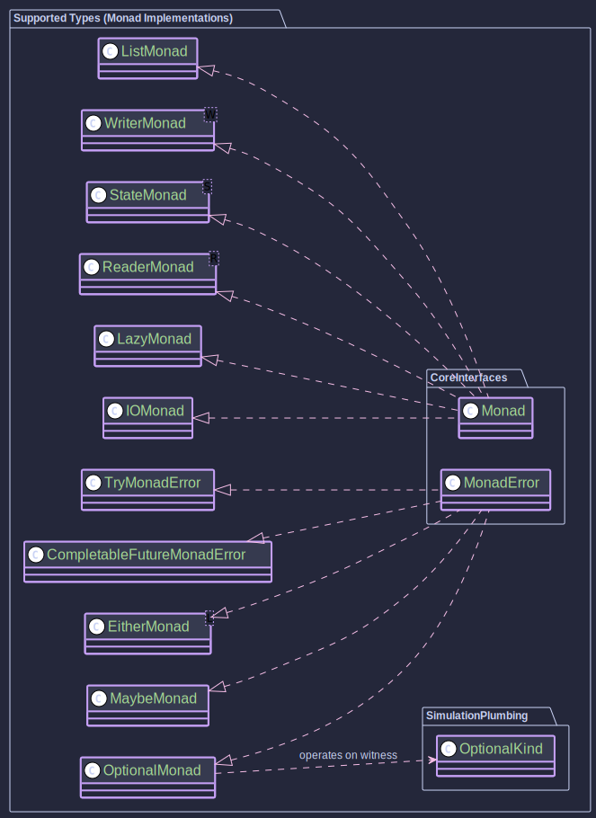
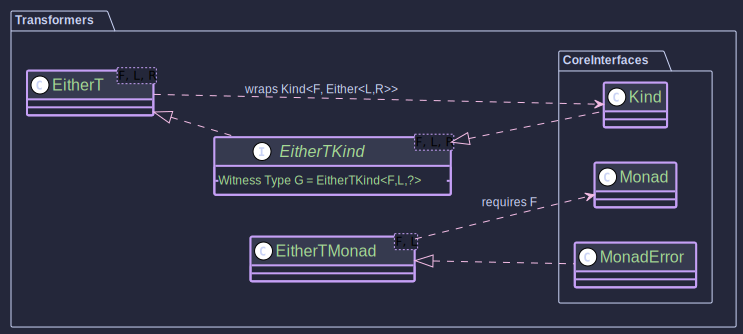

# Supported Types in HKT Simulation

This simulation currently provides Higher-Kinded Type wrappers (`Kind<F, A>`) and corresponding type class instances (`Functor`, `Applicative`, `Monad`, `MonadError`) for the following Java types and custom types.

---

### 1. `java.util.List<A>`

* **Kind Interface:** `ListKind<A>`
* **Witness Type `F`:** `ListKind<?>`
* **Helper:** `ListKindHelper` (`wrap`, `unwrap`)
* **Type Class Instances:**
  * `ListFunctor` (`Functor`)
  * `ListMonad` (`Monad`, `Applicative`)
* **Notes:** Standard list monad behavior. `map` applies a function to each element. `flatMap` applies a function returning a `ListKind` to each element and concatenates the resulting lists. `ap` applies functions in a list to values in another list (Cartesian product). `of(a)` creates `List(a)`.

---

### 2. `java.util.Optional<A>`

* **Kind Interface:** `OptionalKind<A>`
* **Witness Type `F`:** `OptionalKind<?>`
* **Helper:** `OptionalKindHelper` (`wrap`, `unwrap`)
* **Type Class Instances:**
  * `OptionalFunctor` (`Functor`)
  * `OptionalMonad` (`Monad`, `Applicative`, `MonadError<..., Void>`)
* **Notes:** Models optionality. Implements `MonadError` where the error type `E` is `Void` (represented by `null`), corresponding to the `Optional.empty()` state. `raiseError(null)` creates an empty `OptionalKind`. `of(null)` also results in an empty `OptionalKind`. `flatMap` chains operations only if the `Optional` is present.

---

### 3. `Maybe<A>` (Custom Type)

* **Definition:** A custom `Optional`-like type ([`Maybe.java`](../src/main/java/org/simulation/hkt/maybe/Maybe.java)) implemented as a sealed interface with `Just` and `Nothing` implementations. `Just` enforces non-null values.
* **Kind Interface:** `MaybeKind<A>`
* **Witness Type `F`:** `MaybeKind<?>`
* **Helper:** `MaybeKindHelper` (`wrap`, `unwrap`, `just`, `nothing`)
* **Type Class Instances:**
  * `MaybeFunctor` (`Functor`)
  * `MaybeMonad` (`Monad`, `Applicative`, `MonadError<..., Void>`)
* **Notes:** Similar to `Optional`, but `Just` cannot hold `null`. Implements `MonadError` where the error type `E` is `Void` (represented by `null`), corresponding to the `Nothing` state. `raiseError(null)` creates a `Nothing` `MaybeKind`. `of(null)` results in `Nothing`.

---

### 4. `Either<L, R>` (Custom Type)

* **Definition:** A custom type ([`Either.java`](../src/main/java/org/simulation/hkt/either/Either.java)) representing a value of one of two types, `Left` (typically error) or `Right` (typically success). Implemented as a sealed interface with `Left` and `Right` record implementations.
* **Kind Interface:** `EitherKind<L, R>`
* **Witness Type `F`:** `EitherKind<L, ?>` (Note: `L` is fixed for a given type class instance)
* **Helper:** `EitherKindHelper` (`wrap`, `unwrap`)
* **Type Class Instances:**
  * `EitherFunctor<L>` (`Functor`)
  * `EitherMonad<L>` (`Monad`, `Applicative`, `MonadError<..., L>`)
* **Notes:** Represents computations that can fail with a *typed* error. Instances are right-biased (`map`/`flatMap` operate on `Right`). Implements `MonadError` where the error type `E` is the `Left` type `L`. `raiseError(l)` creates a `Left(l)` `EitherKind`. `of(r)` creates `Right(r)`. Useful for handling domain-specific errors explicitly.
* **Usage:** How to use the [Either Monad](either_monad.md) with HKT Simulation

---

### 5. `Try<T>` (Custom Type)

* **Definition:** A custom type ([`Try.java`](../src/main/java/org/simulation/hkt/trymonad/Try.java)) representing a computation that might succeed (`Success<T>`) or fail with a `Throwable` (`Failure<T>`). Implemented as a sealed interface with `Success` and `Failure` record implementations.
* **Kind Interface:** `TryKind<T>`
* **Witness Type `F`:** `TryKind<?>`
* **Helper:** `TryKindHelper` (`wrap`, `unwrap`, `success`, `failure`, `tryOf`)
* **Type Class Instances:**
  * `TryFunctor` (`Functor`)
  * `TryApplicative` (`Applicative`)
  * `TryMonad` (`Monad`)
  * `TryMonadError` (`MonadError<..., Throwable>`)
* **Notes:** Useful for wrapping computations that might throw arbitrary exceptions. Implements `MonadError` where the error type `E` is `Throwable`. `raiseError(t)` creates a `Failure(t)` `TryKind`. `of(v)` creates `Success(v)`. `flatMap` propagates failures or exceptions thrown during mapping.
* **Usage:** How to use the [Try Monad](try_monad.md) with HKT Simulation

---

### 6. `java.util.concurrent.CompletableFuture<T>`

* **Kind Interface:** `CompletableFutureKind<A>`
* **Witness Type `F`:** `CompletableFutureKind<?>`
* **Helper:** `CompletableFutureKindHelper` (`wrap`, `unwrap`, `join`)
* **Type Class Instances:**
  * `CompletableFutureFunctor` (`Functor`)
  * `CompletableFutureApplicative` (`Applicative`)
  * `CompletableFutureMonad` (`Monad`)
  * `CompletableFutureMonadError` (`MonadError<..., Throwable>`)
* **Notes:** Allows treating asynchronous computations monadically. `map` and `flatMap` correspond to `thenApply` and `thenCompose`. Implements `MonadError` where the error type `E` is `Throwable`, representing the exception that caused the future to fail. `raiseError(t)` creates a `failedFuture(t)`. `of(v)` creates a `completedFuture(v)`. `ap` uses `thenCombine`.

---

### 7. `IO<A>` (Custom Type)

* **Definition:** A custom type ([`IO.java`](../src/main/java/org/simulation/hkt/io/IO.java)) representing a potentially side-effecting computation that produces a value `A`. Evaluation is deferred until `unsafeRunSync()` is called.
* **Kind Interface:** `IOKind<A>`
* **Witness Type `F`:** `IOKind<?>`
* **Helper:** `IOKindHelper` (`wrap`, `unwrap`, `delay`, `unsafeRunSync`)
* **Type Class Instances:**
  * `IOFunctor` (`Functor`)
  * `IOApplicative` (`Applicative`)
  * `IOMonad` (`Monad`)
* **Notes:** Encapsulates side effects (console I/O, file access, network calls, random numbers, system time). `map` and `flatMap` sequence effects lazily. `of(a)` creates an `IO` that returns `a` without side effects. `IOKindHelper.delay(() -> ...)` is the primary way to capture a side-effecting computation. *Does not* implement `MonadError` by default, as exceptions during `unsafeRunSync` are typically unhandled unless explicitly caught within the `IO`'s definition.

---

### 8. `Lazy<A>` (Custom Type)

* **Definition:** A custom type ([`Lazy.java`](../src/main/java/org/simulation/hkt/lazy/Lazy.java)) representing a value whose computation is deferred until explicitly requested via `force()` and then memoised (cached).
* **Kind Interface:** `LazyKind<A>`
* **Witness Type `F`:** `LazyKind<?>`
* **Helper:** `LazyKindHelper` (`wrap`, `unwrap`, `defer`, `now`, `force`)
* **Type Class Instances:**
  * `LazyMonad` (`Monad`, `Applicative`, `Functor`)
* **Notes:** Useful for expensive computations or values that should only be calculated if needed. `map` and `flatMap` preserve laziness. `of(a)` creates an already evaluated `Lazy` instance (`Lazy.now`). `LazyKindHelper.defer(() -> ...)` creates an unevaluated `Lazy`. Exceptions during computation are caught, memoised, and re-thrown by `force()`.

---

### 9. `Reader<R, A>` (Custom Type)

* **Definition:** A custom type ([`Reader.java`](../src/main/java/org/simulation/hkt/reader/Reader.java)) representing a computation that depends on reading a value from a shared, read-only environment `R` to produce a value `A`. Essentially wraps `Function<R, A>`.
* **Kind Interface:** `ReaderKind<R, A>`
* **Witness Type `F`:** `ReaderKind<R, ?>` (Note: `R` is fixed for a given type class instance)
* **Helper:** `ReaderKindHelper` (`wrap`, `unwrap`, `reader`, `ask`, `constant`, `runReader`)
* **Type Class Instances:**
  * `ReaderFunctor<R>` (`Functor`)
  * `ReaderApplicative<R>` (`Applicative`)
  * `ReaderMonad<R>` (`Monad`)
* **Notes:** Facilitates dependency injection. `map` and `flatMap` compose functions that operate within the context of the environment `R`. `ask()` provides access to the environment itself. `of(a)` creates a `Reader` that ignores the environment and returns `a`.
* **Usage:** How to use the [Reader Monad](reader_monad.md) with HKT Simulation
---

### 10. `State<S, A>` (Custom Type)

* **Definition:** A custom type ([`State.java`](../src/main/java/org/simulation/hkt/state/State.java)) representing a stateful computation that takes an initial state `S`, produces a value `A`, and returns a new state `S`. Wraps `Function<S, StateTuple<S, A>>`.
* **Kind Interface:** `StateKind<S, A>`
* **Witness Type `F`:** `StateKind<S, ?>` (Note: `S` is fixed for a given type class instance)
* **Helper:** `StateKindHelper` (`wrap`, `unwrap`, `pure`, `get`, `set`, `modify`, `inspect`, `runState`, `evalState`, `execState`)
* **Type Class Instances:**
  * `StateFunctor<S>` (`Functor`)
  * `StateApplicative<S>` (`Applicative`)
  * `StateMonad<S>` (`Monad`)
* **Notes:** Models computations where state needs to be threaded through a sequence of operations. `flatMap` sequences computations, passing the resulting state from one step to the next. `get()` retrieves the current state, `set(s)` updates it, `modify(f)` updates it using a function. `of(a)` (`pure`) returns `a` without changing state.

---

### 11. `Writer<W, A>` (Custom Type)

* **Definition:** A custom type ([`Writer.java`](../src/main/java/org/simulation/hkt/writer/Writer.java)) representing a computation that produces a value `A` while accumulating a log or output `W`. Requires a `Monoid<W>` for combining logs.
* **Kind Interface:** `WriterKind<W, A>`
* **Witness Type `F`:** `WriterKind<W, ?>` (Note: `W` and its `Monoid` are fixed for a given type class instance)
* **Helper:** `WriterKindHelper` (`wrap`, `unwrap`, `value`, `tell`, `runWriter`, `run`, `exec`)
* **Type Class Instances:**
  * `WriterFunctor<W>` (`Functor`)
  * `WriterApplicative<W>` (`Applicative`)
  * `WriterMonad<W>` (`Monad`)
* **Notes:** Useful for logging or accumulating results alongside the main computation. `flatMap` sequences computations and combines their logs using the provided `Monoid`. `tell(w)` logs a value `w` without producing a main result. `of(a)` (`value`) produces `a` with an empty log.
* **Usage:** How to use the [Writer Monad](writer_monad.md) with HKT Simulation
---

### 12. `EitherT<F, L, R>` (Monad Transformer)

* **Definition:** A monad transformer ([`EitherT.java`](../src/main/java/org/simulation/hkt/trans/EitherT.java)) that combines an outer monad `F` with an inner `Either<L, R>`. Implemented as a record wrapping `Kind<F, Either<L, R>>`.
* **Kind Interface:** `EitherTKind<F, L, R>`
* **Witness Type `G`:** `EitherTKind<F, L, ?>` (where `F` and `L` are fixed for a given type class instance)
* **Helper:** No dedicated helper; use `EitherT` static factories (`fromKind`, `right`, `left`, `fromEither`, `liftF`) and access the inner value via `eitherT.value()`.
* **Type Class Instances:**
  * `EitherTMonad<F, L>` (`MonadError<EitherTKind<F, L, ?>, L>`)
* **Notes:** Simplifies working with nested structures like `F<Either<L, R>>`. Requires a `Monad<F>` instance for the outer monad `F` passed to its constructor. Implements `MonadError` for the *inner* `Either`'s `Left` type `L`. See the [Order Example Walkthrough](order-walkthrough.md) for practical usage with `CompletableFuture` as `F`.

**Usage:** How to use the [EitherT Monad Transformer](eithert_transformer.md) with HKT Simulation

