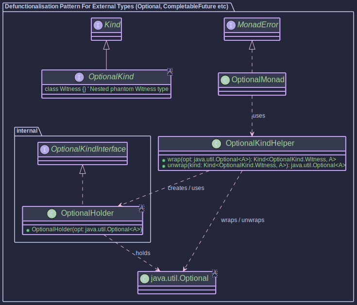

# Core Concepts of Higher-Kinded-J

Higher-Kinded-J employs several key components to emulate Higher-Kinded Types (HKTs) and associated functional type classes in Java. Understanding these is crucial for using and extending the library.

## 1. The HKT Problem in Java

Java's type system lacks native Higher-Kinded Types. We can easily parameterise a type by another type (like `List<String>`), but we cannot easily parameterise a type or method by a *type constructor* itself (like `F<_>`). We can't write `void process<F<_>>(F<Integer> data)` to mean "process any container F of Integers".

## 2. The `Kind<F, A>` Bridge


* **Purpose:** To simulate the application of a type constructor `F` (like `List`, `Optional`, `IO`) to a type argument `A` (like `String`, `Integer`), representing the concept of `F<A>`.
* **`F` (Witness Type):** This is the crucial part of the simulation. Since `F<_>` isn't a real Java type parameter, we use a *marker type* (often an empty interface specific to the constructor) as a "witness" or stand-in for `F`. Examples:
  * `ListKind<ListKind.Witness>` represents the `List` type constructor.
  * `OptionalKind<OptionalKind.Witness>` represents the `Optional` type constructor.
  * `EitherKind.Witness<L>` represents the `Either<L, _>` type constructor (where `L` is fixed).
  * `IOKind<IOKind.Witness>` represents the `IO` type constructor.
* **`A` (Type Argument):** The concrete type contained within or parameterised by the constructor (e.g., `Integer` in `List<Integer>`).
* **How it Works:** An actual object, like a `java.util.List<Integer>`, is wrapped in a helper class (e.g., `ListHolder`) which implements `Kind<ListKind<?>, Integer>`. This `Kind` object can then be passed to generic functions that expect `Kind<F, A>`.
* **Reference:** [`Kind.java`](https://github.com/higher-kinded-j/higher-kinded-j/tree/main/src/main/java/org/higherkindedj/hkt/Kind.java)

## 3. Type Classes (`Functor`, `Applicative`, `Monad`, `MonadError`)

These are interfaces that define standard functional operations that work *generically* over any simulated type constructor `F` (represented by its witness type) for which an instance of the type class exists. They operate on `Kind<F, A>` objects.


* **`Functor<F>`:**
  * Defines `map(Function<A, B> f, Kind<F, A> fa)`: Applies a function `f: A -> B` to the value(s) inside the context `F` without changing the context's structure, resulting in a `Kind<F, B>`. Think `List.map`, `Optional.map`.
  * Laws: Identity (`map(id) == id`), Composition (`map(g.compose(f)) == map(g).compose(map(f))`).
  * Reference: [`Functor.java`](https://github.com/higher-kinded-j/higher-kinded-j/tree/main/src/main/java/org/higherkindedj/hkt/Functor.java)
* **`Applicative<F>`:**
  * Extends `Functor<F>`.
  * Adds `of(A value)`: Lifts a pure value `A` into the context `F`, creating a `Kind<F, A>`. (e.g., `1` becomes `Optional.of(1)` wrapped in `Kind`).
  * Adds `ap(Kind<F, Function<A, B>> ff, Kind<F, A> fa)`: Applies a function wrapped in context `F` to a value wrapped in context `F`, returning a `Kind<F, B>`. This enables combining multiple independent values within the context.
  * Provides default `mapN` methods (e.g., `map2`, `map3`) built upon `ap` and `map`.
  * Laws: Identity, Homomorphism, Interchange, Composition.
  * Reference: [`Applicative.java`](https://github.com/higher-kinded-j/higher-kinded-j/tree/main/src/main/java/org/higherkindedj/hkt/Applicative.java)
* **`Monad<F>`:**
  * Extends `Applicative<F>`.
  * Adds `flatMap(Function<A, Kind<F, B>> f, Kind<F, A> ma)`: Sequences operations within the context `F`. Takes a value `A` from context `F`, applies a function `f` that returns a *new context* `Kind<F, B>`, and returns the result flattened into a single `Kind<F, B>`. Essential for chaining dependent computations (e.g., chaining `Optional` calls, sequencing `CompletableFuture`s, combining `IO` actions). Also known in functional languages as `bind` or `>>=`.
  * Laws: Left Identity, Right Identity, Associativity.
  * Reference: [`Monad.java`](https://github.com/higher-kinded-j/higher-kinded-j/tree/main/src/main/java/org/higherkindedj/hkt/Monad.java)
* **`MonadError<F, E>`:**
  * Extends `Monad<F>`.
  * Adds error handling capabilities for contexts `F` that have a defined error type `E`.
  * Adds `raiseError(E error)`: Lifts an error `E` into the context `F`, creating a `Kind<F, A>` representing the error state (e.g., `Either.Left`, `Try.Failure` or failed `CompletableFuture`).
  * Adds `handleErrorWith(Kind<F, A> ma, Function<E, Kind<F, A>> handler)`: Allows recovering from an error state `E` by providing a function that takes the error and returns a *new context* `Kind<F, A>`.
  * Provides default recovery methods like `handleError`, `recover`, `recoverWith`.
  * Reference: [`MonadError.java`](https://github.com/higher-kinded-j/higher-kinded-j/tree/main/src/main/java/org/higherkindedj/hkt/MonadError.java)

## 4. Defunctionalisation (Per Type Constructor)

For each Java type constructor (like `List`, `Optional`, `IO`) you want to simulate as a Higher-Kinded Type, a specific pattern involving several components is used. The exact implementation differs slightly depending on whether the type is defined *within* the Higher-Kinded-J library (e.g., `Id`, `Maybe`, `IO`, monad transformers) or if it's an *external type* (e.g., `java.util.List`, `java.util.Optional`, `java.util.concurrent.CompletableFuture`).

**Common Components:**

* **The `XxxKind` Interface:** A specific marker interface, for example, `OptionalKind<A>`. This interface extends `Kind<F, A>`, where `F` is the witness type representing the type constructor.
  * **Example:** `public interface OptionalKind<A> extends Kind<OptionalKind.Witness, A> { /* ... Witness class ... */ }`
  * The `Witness` (e.g., `OptionalKind.Witness`) is a static nested final class (or a separate accessible class) within `OptionalKind`. This `Witness` type is what's used as the `F` parameter in generic type classes like `Monad<F>`.

* **The `KindHelper` Class (e.g., `OptionalKindHelper`):** A crucial utility class with static `wrap` and `unwrap` methods:
  * `wrap(...)`: Converts the standard Java type (e.g., `Optional<String>`) into its `Kind<F, A>` representation.
  * `unwrap(Kind<F, A> kind)`: Converts the `Kind<F, A>` representation back to the underlying Java type (e.g., `Optional<String>`).
    * **Crucially, this method throws `KindUnwrapException` if the input `kind` is structurally invalid** (e.g., `null`, the wrong `Kind` type, or, where applicable, a `Holder` containing `null` where it shouldn't). This ensures robustness.
  * May contain other convenience factory methods.

* **Type Class Instance(s):** Concrete classes implementing `Functor<F>`, `Monad<F>`, etc., for the specific witness type `F` (e.g., `OptionalMonad implements Monad<OptionalKind.Witness>`). These instances use the `KindHelper`'s `wrap` and `unwrap` methods to operate on the underlying Java types.

**External Types:**



* **For External Types (e.g., `java.util.Optional`, `java.util.List`, `java.util.concurrent.CompletableFuture`):**
  * Since these JDK classes cannot be modified to directly implement an interface like `OptionalKind<A>`, an **internal `Holder` record** is necessary.
  * **Example (`OptionalHolder`):**
      ```java
      // Typically package-private within OptionalKindHelper.java
      record OptionalHolder<A>(@NonNull java.util.Optional<A> optional) implements OptionalKind<A> {}
      ```
  * The `OptionalKindHelper.wrap(java.util.Optional<A> opt)` method will create and return an `new OptionalHolder<>(opt)`.
  * The `OptionalKindHelper.unwrap(Kind<OptionalKind.Witness, A> kind)` method will check if `kind` is an `instanceof OptionalHolder`, then extract the `java.util.Optional<A>` from it.

**Higher-Kinded-J Types:**


* **For Types Defined Within Higher-Kinded-J (e.g., `Id`, `Maybe`, `IO`, Monad Transformers like `EitherT`):**
  * These types are designed to directly participate in the HKT simulation.
  * The type itself (e.g., `Id<A>`, `MaybeT<F, A>`) will directly implement its corresponding `XxxKind` interface (e.g., `Id<A> implements IdKind<A>`, where `IdKind<A> extends Kind<Id.Witness, A>`).
  * In this case, a separate `Holder` record is **not needed** for the primary `wrap`/`unwrap` mechanism in the `KindHelper`.
  * `XxxKindHelper.wrap(Id<A> id)` would effectively be a type cast (after null checks) to `Kind<Id.Witness, A>` because `Id<A>` *is already* an `IdKind<A>`.
  * `XxxKindHelper.unwrap(Kind<Id.Witness, A> kind)` would check `instanceof Id` (or `instanceof MaybeT`, etc.) and perform a cast.

This distinction is important for understanding how `wrap` and `unwrap` function for different types. However, from the perspective of a user of a type class instance (like `OptionalMonad`), the interaction remains consistent: you provide a `Kind` object, and the type class instance handles the necessary operations.

## 5. Error Handling Philosophy

* **Domain Errors:** These are expected business-level errors or alternative outcomes. They are represented *within* the structure of the simulated type (e.g., `Either.Left`, `Maybe.Nothing`, `Try.Failure`, a failed `CompletableFuture`, potentially a specific result type within `IO`). These are handled using the type's specific methods or `MonadError` capabilities (`handleErrorWith`, `recover`, `fold`, `orElse`, etc.) *after* successfully unwrapping the `Kind`.
* **Simulation Errors (`KindUnwrapException`):** These indicate a problem with the HKT simulation *itself* – usually a programming error. Examples include passing `null` to `unwrap`, passing a `ListKind` to `OptionalKindHelper.unwrap`, or (if it were possible) having a `Holder` record contain a `null` reference to the underlying Java object it's supposed to hold. These are signalled by throwing the unchecked `KindUnwrapException` from `unwrap` methods to clearly distinguish infrastructure issues from domain errors. You typically shouldn't need to catch `KindUnwrapException` unless debugging the simulation usage itself.
